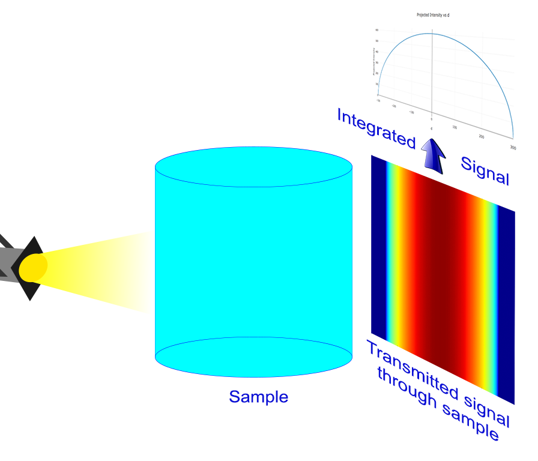
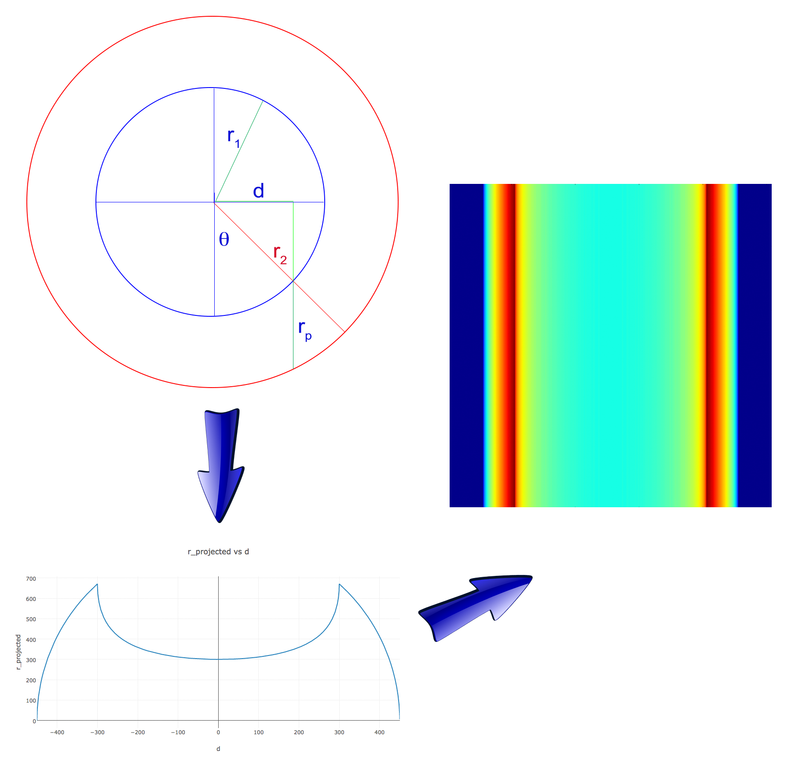

# CylindricalGeometryCorrection
This library produces a FITS image with the cylindrical geometry corrected (hollow or not).

# Principle
Any homegenous cylindrical sample placed in a beam (neutron for example) will show a much higher transmission signal
near the edge seen by the beam, compare to the center. This is simply due to the fact that the beam has to go through
more material at the center compare to the side.

The following figure illustrate this.

In order to correctly analyze data for those samples, one must cancel this cylindrical effect by "making" the sample
flat related to the direction of the beam.

The user needs to specify the position of the center as well as the radius of the cylinder. The program will then produce
an image corresponding to the same rectangular sample.

Such samples are called homogeneous because they are made of only one uniform and homogeneous material.

But program also work with inhomogenous sample for which the cylinder is hollow such as shown here.

Program works the same way, user needs to specify center and inner and outer radius of material sample.

# Tests
to run the tests
> pytest -v --cov=tests/

