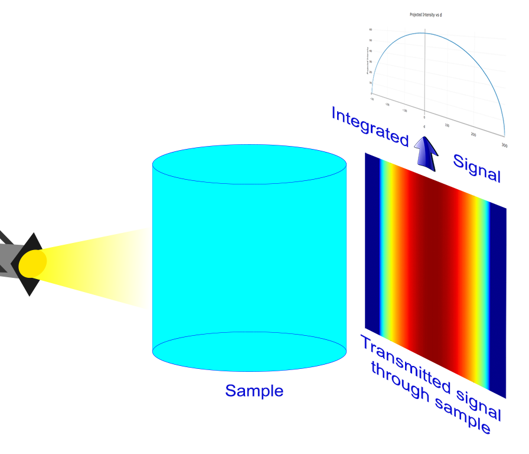
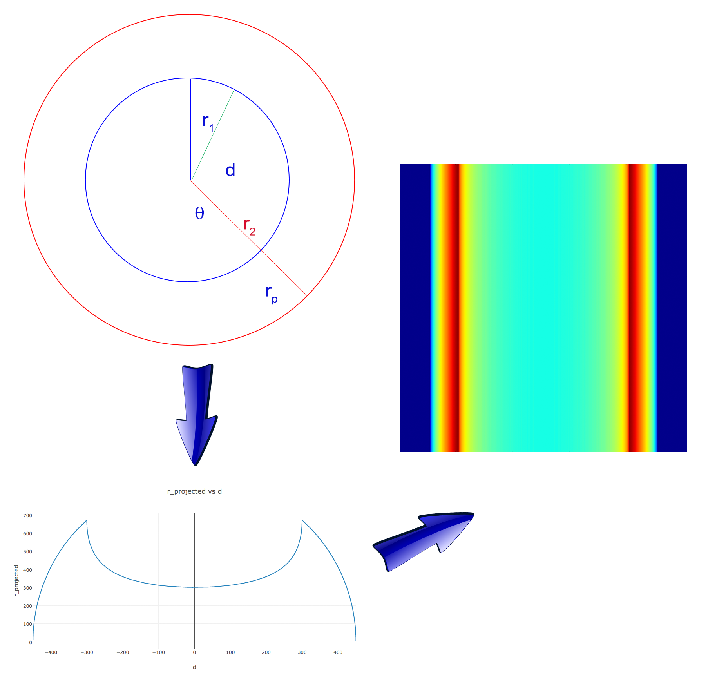

[](https://cylindricalgeometrycorrection.readthedocs.io/en/latest/?badge=latest)

# neutron-geomcorr (Neutron Geometry Correction)

Formerly known as CylindricalGeometryCorrection, this library performs geometric corrections for neutron transmission imaging of cylindrical samples (both solid and hollow).

# Principle
Any homegenous cylindrical sample placed in a beam (neutron for example) will show a much higher transmission signal
near the edge seen by the beam, compare to the center. This is simply due to the fact that the beam has to go through
more material at the center compare to the side.

ATTENTION: This library only works with cylinder placed in the vertical position!

The following figure illustrate this.



In order to correctly analyze data for those samples, one must cancel this cylindrical effect by "making" the sample
flat related to the direction of the beam.

The user needs to specify the position of the center as well as the radius of the cylinder. The program will then produce
an image corresponding to the same rectangular sample.

Such samples are called homogeneous because they are made of only one uniform and homogeneous material.

But program also work with inhomogeneous sample for which the cylinder is hollow such as shown here.



Program works the same way, user needs to specify center and inner and outer radius of material sample.

# Installation

## Using Pixi (Recommended for Development)
```bash
# Install pixi if you haven't already
curl -fsSL https://pixi.sh/install.sh | bash

# Clone the repository
git clone https://github.com/ornlneutronimaging/CylindricalGeometryCorrection.git
cd CylindricalGeometryCorrection

# Install dependencies and setup environment
pixi install

# Run Python with the package
pixi run python
```

## Using pip
```bash
pip install neutron-geomcorr
```

## Using conda
```bash
conda install -c neutronimaging neutron-geomcorr
```

# Usage

```python
from neutron_geomcorr.geometry_correction import GeometryCorrection

# Initialize with your image files
o_cgc = GeometryCorrection(list_files=['image1.tif', 'image2.tif'])
o_cgc.load_files()

# Define cylinder parameters
o_cgc.define_parameters(pixel_center=256, outer_radius=200)

# Run correction
o_cgc.correct()

# Access corrected data
corrected_images = o_cgc.list_data_corrected
```

# Development

## Running Tests
```bash
pixi run test
```

## Building Documentation
```bash
pixi run build-docs
```

## Building Package
```bash
# For PyPI
pixi run pypi-build

# For conda
pixi run conda-build
```

# Tutorial
It's recommended to follow the notebook tutorials in the `notebooks/` directory to learn how to use the library
