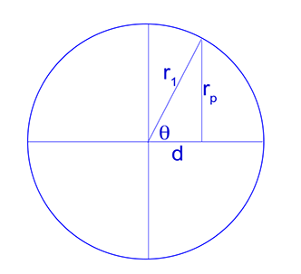
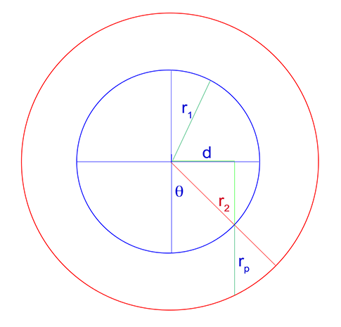

************
Introduction
************

This library has been created to remove the non constant thickness effect of a cylinder sample placed in our neutron
(works also for X-ray) beam. For such sample, the transmission signal will be much higher on the edge compare to the
center of the sample. Post analysis of such sample is then very challenging. This library creates a new image
corresponding to a sample of constant thickness. Thickness being the diameter of the original sample.

Principle
=========

Any homogeneous cylindrical sample placed in a beam (neutron for example) will show a much higher transmission signal
near the edge seen by the beam, compare to the center. This is simply due to the fact that the beam has to go through
more material at the center compare to the side.

**ATTENTION** This library only works with cylinder placed in the vertical position!

The following figure illustrate the experimental set up and the signal measure for an homogeneous and inhomogeneous
sample

In order to correctly analyze data for those samples, one must cancel this cylindrical effect by "making" the sample
flat related to the direction of the beam.

The user needs to specify the position of the center as well as the radius of the cylinder. The program will then produce
an image corresponding to the same sample as if it was rectangular.

Such samples are called homogeneous because they are made of only one uniform and homogeneous material.

.. image:: _static/homogeneous_cylinder_2d_view.png

But program also work with inhomogeneous sample for which the cylinder is hollow such as shown here.

.. image:: _static/inhomogeneous_cylinder_2d_view.png

Program works the same way, user needs to specify center, inner and outer radius of material sample.

In order to run, the program only requires the user to define

 * the center of the cylinder(s)
 * the radius(dii) of the cylinder(s)

.. attention::

   The correction implemented here is a **linear chord-length division**:
   it flattens inputs that are proportional to the neutron path length
   (attenuation maps, −ln(T), thickness-calibrated data). It is *not* the
   Beer-Lambert (exponential) correction required for raw transmission
   data — that derivation lives in :doc:`derivation` and its
   implementation is tracked in
   `issue #57 <https://github.com/ornlneutronimaging/CylindricalGeometryCorrection/issues/57>`_.

Algorithm
=========

Homogeneous Cylinder
********************

Let's consider a solid cylinder of radius :math:`R` centered on the
vertical axis, with the beam direction perpendicular to it.

At horizontal offset :math:`x` from the center, the chord length the beam
traverses through the cylinder is

.. math::

    r_p(x) = 2 R \sin\!\left(\arccos\left(\frac{x}{R}\right)\right)

and the correction factor scales each pixel by the ratio of the center
thickness to the local chord length, :math:`2R / r_p(x)`. The exact
behavior — including the value 1 at the center, NaN at the tangent edges
:math:`|x| = R` (zero chord length), and 0 outside the cylinder — is
documented on the implementing method, rendered here directly from the
source so it cannot drift:

.. automethod:: neutron_geomcorr.geometry_correction.GeometryCorrection.homogeneous_correction

Inhomogeneous (Hollow) Cylinder
*******************************

For a hollow cylinder with **outer radius** :math:`R_\text{out}` and
**inner radius** :math:`R_\text{in}` (the API calls these *Radius 1* and
*Radius 2* respectively, and always stores the larger value as the outer
radius), the chord length has three regimes: through both walls and the
bore (:math:`|x| < R_\text{in}`), through the solid wall section
(:math:`R_\text{in} \le |x| < R_\text{out}`), and outside the cylinder.

The correction normalizes by the center thickness
:math:`2(R_\text{out} - R_\text{in})`:

.. automethod:: neutron_geomcorr.geometry_correction.GeometryCorrection.inhomogeneous_correction

Output geometry
***************

The corrected image of each input has shape
``(height, 2*outer_radius - 1)``: the cylinder region spans the columns
:math:`x \in [-R, R]` and the two edge columns :math:`x = \pm R` are
trimmed, because the chord length vanishes there and the correction is
undefined.
